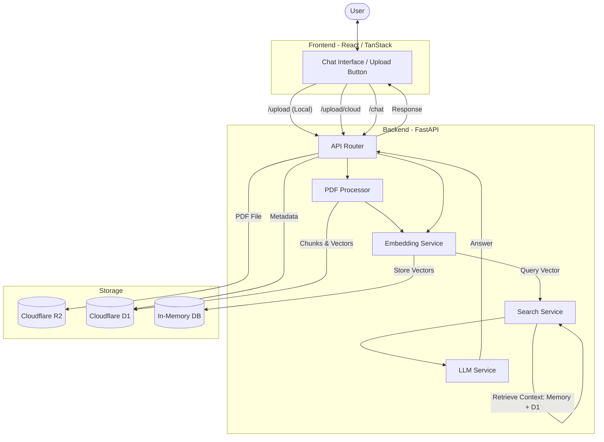

# PDFHelper

This repository contains a basic working PDF Helper/ PDF Chatbox clone

Frontend - React/Tanstack Start
Backend - Python/FastAPI

## System Architecture

The following flowchart describes the data flow from PDF upload to AI-powered chat response.

## Features
- **Local Upload**: Quick processing with in-memory storage.
- **Cloud Upload**: Persistent storage using Cloudflare R2 and D1.
- **RAG (Retrieval Augmented Generation)**: Intelligent context retrieval for accurate answers based on your documents.
